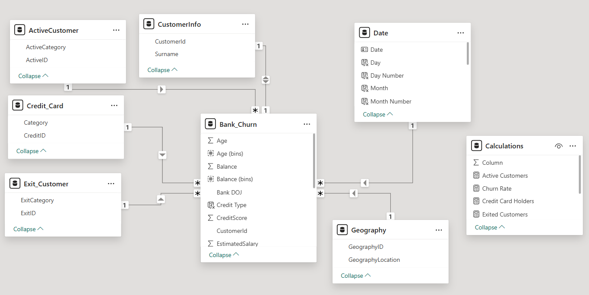
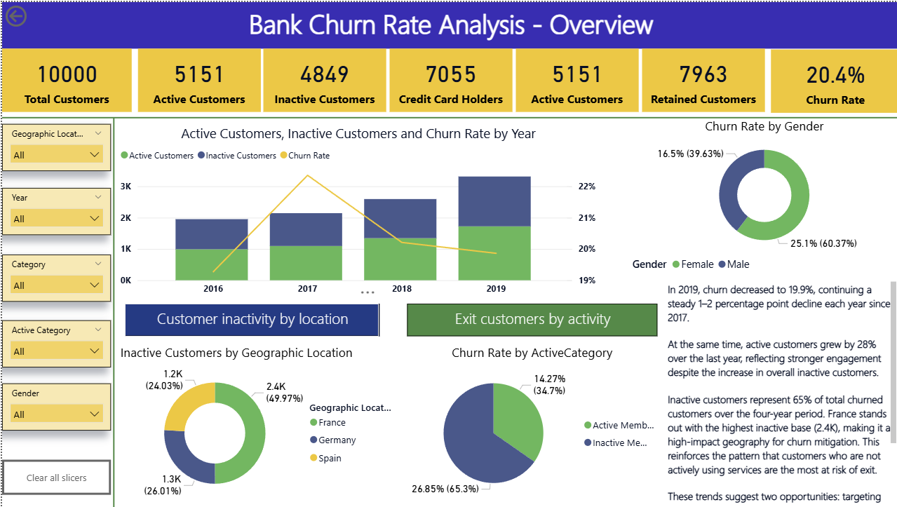
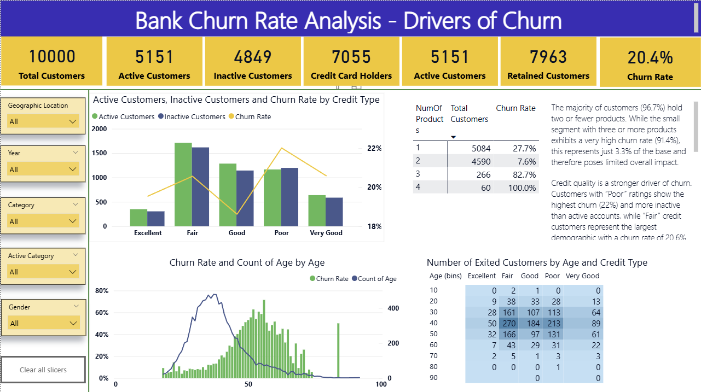

# Anchor Bank Churn Analysis

## Project Background

Anchor Bank, established in 2016, is a European financial institution providing secure and modern banking to clients in Germany, Spain, and France.

As an emerging company, Anchor Bank wants to investigate customer churn with the aim of 
1. Increasing customer satisfaction.
2. Reducing risk.
3. Maximising revenue.
4. Build trustworthiness and customer loyalty.

This project thoroughly analyses customer data in order to uncover insights that will support Anchor Bank's growth and reputation.

Insights and recommendations are provided on the following key areas:
- __Churn Trend Analysis__: How has churn evolved over time, and how does it differ across regions? Which customer segments of customers show the highest exit rates?
- __Product Performance__: How do customer engagement and satisfaction vary by product holding? Are certain product combinations linked to higher churn?
- __Customer Profiles__: Which demographic and behavioural characteristics (e.g., age, gender, credit rating, activity level) are most associated with churn?
- __Retention Priorities__: Where should Anchor Bank focus its efforts to achieve the biggest impact in reducing churn?

An interactive PowerBI report can be downloaded [here](Bank.pbix).
The findings are presented in two layers:
- __Overview (Page 1)__: High-level trends and key customer segments at risk.
- __Drivers (Page 2)__: Deeper analysis of underlying casues of churn and actionale recommendations.

## Data Modelling 

To support the churn analysis, a data model was developed in PowerBI using a star schema design. This design ensures clear relationships between the fact table and dimension tables.
- __Fact Table__: Bank_churn.
- __Dimension Tables__: Date, CustomerInfo, ActiveCustomers, Credit_card, Exit_Customer, Geography.

## Executive Summary

The analysis revealed that customer __churn has steadily declined__ over the last two years, reaching __19.9% in 2019__, alongside a __28% YoY increase in active customers__. However, __inactive customers account for 65% of overall exits__, highlighting engagement gaps as the most significant risk factor. __France__ has the highest inactive customer base, while __female customers__ showed marginally higher churn rates than males. 

Further diagnostic analysis identified custoemrs with __"Fair" and "Poor" credit ratings__ and those aged __40-60__ are most likely to exit, with churn rates as high as __22%__ in low-credit groups. In contrast, the majority of customers (97%) held __two or fewer products__, indicating limited cross-product engagement and potential for deeper product adoption.

To address these findings, targeted recommendations were developed:
- __Re-engagement programs__ for inactive users through personalised communication/offers and product education.
- __Tailored credit solutions__ and flexible repayment options for customers with low credit ratings.
- __Implement retention campaigns__ tailored to the preferences and engagement patterns of customers aged 40-60, such as loyalty incentives or product bundle offers, to address higher churn risk and preserve high-value relationships.

## Churn Trends

## Churn Causes

